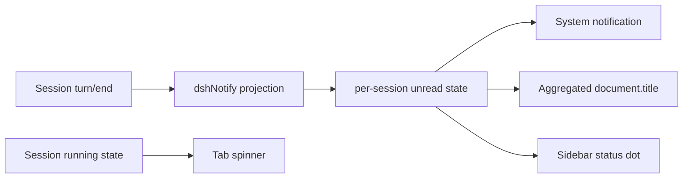

<h1 align="center">DSH Notify</h1>

<p align="center">
  <strong>让 DeepSeek Harness 的运行中、完成与异常状态，在系统通知、浏览器 Tab 和侧栏会话列表中同时可见。</strong>
</p>

<p align="center">
  <a href="LICENSE"></a>
  
  
  
</p>

<p align="center">
  中文 · <a href="#快速开始">快速开始</a> · <a href="#它为-dsh-带来什么">DSH 价值</a> · <a href="#能力">能力</a> · <a href="#配置">配置</a>
</p>

`dsh-notify` 是一个标准 bundle 形态、零 Harness 核心修改的 DeepSeek Harness 插件。它从 Session 日志的 `turn/end` 事件派生准确的完成原因，在浏览器端维护每个会话的未读状态，再统一驱动系统通知、Tab 标题和侧栏状态圆点。

插件不会增加模型工具、提示词或 token 开销。通知逻辑只读取已有 Session 投影和浏览器状态。

## 它为 DSH 带来什么

| 默认 DSH Web | 安装 DSH Notify 后 |
| --- | --- |
| 多个浏览器 Tab 外观相同，难以识别哪个仍在执行 | 运行中的 Tab 显示 Unicode 转圈动画和运行会话数 |
| 离开页面后要主动回来确认结果 | 完成、错误、中止、阻塞、令牌限制均可弹出系统通知 |
| 多个会话结束后，Tab 标题无法概览未读结果 | 标题按结束原因折叠计数，并支持跑马灯或闪烁 |
| 侧栏通用完成提示无法区分异常原因 | 正常完成显示绿色波纹圆点，异常结果显示红色波纹圆点 |
| 通知权限拒绝后缺少明确恢复入口 | 设置页显示实时权限状态，并提示从站点设置重新授权 |



## 快速开始

要求：Node.js `>=22`、`pnpm` 在 `PATH` 中，以及支持 client plugin 的 DeepSeek Harness Web profile。

### 一键安装

GitHub tag archive 包含已构建的 `lib/` 产物，用户侧不需要拉取源码或执行构建。配置 remote、推送首个 commit 并发布 tag 后，将 `<owner>` 替换为实际 GitHub owner：

```sh
dsh plugin --profile web add "https://github.com/<owner>/dsh-notify/archive/refs/tags/v0.1.0.tar.gz"
```

当前仓库尚未配置 remote，因此 release tag 发布前远程命令不会生效。

如需从 Git 源安装，要求目标 tag/分支已经提交 `lib/` 构建产物：

```sh
dsh plugin --profile web add "github:<owner>/dsh-notify#main"
```

安装成功后重启当前 `dsh web` 进程并刷新页面。进入 **设置 > 通知** 授予浏览器通知权限；其余功能默认开启。

### 本地安装

在本仓库根目录执行一条命令：

```sh
dsh plugin --profile web add "file:$PWD"
```

### 一键卸载

```sh
dsh plugin --profile web remove dsh-notify
```

卸载后重启 `dsh web`。CLI 会同时移除 profile 依赖和 `dsh-notify` bundle 配置层。

### 更新

```sh
dsh plugin --profile web update dsh-notify
```

## 能力

### 系统通知

- 支持 `completed`、`error`、`aborted`、`blocked`、`max-tokens` 五类 `turn/end` 结果。
- 五类结果默认全部开启，可逐项关闭；关闭总开关或某类结果时，已有对应未读标记会立即清除。
- 点击通知会聚焦 DSH 窗口、打开对应会话并清除该会话的未读状态。
- 可配置仅在页面隐藏或正在查看其他会话时弹出。
- 设置页可请求权限和发送真实测试通知。
- 权限被拒后，浏览器不会再次显示授权弹窗；设置页会提示从地址栏左侧的站点设置中重新允许通知。

### 浏览器 Tab 标题

运行中的 Tab 默认显示多帧 Unicode spinner：

```text
⠋ dsh (2 个会话进行中)
⠙ dsh (2 个会话进行中)
⠹ dsh (2 个会话进行中)
```

`document.title` 不能渲染 CSS、SVG 或 Canvas，因此不能直接复用 DSH 侧栏的像素环动画。多帧 Unicode 字符是浏览器标题层可用、跨平台且不需要 favicon 重绘的方案。

结束状态会按原因聚合，而不是把每个会话标题全部塞进 Tab：

```text
dsh (2 个会话进行中 · 3 个会话已完成 · 1 个会话错误 · 1 个会话阻塞)
```

- 运行中 spinner 默认开启，可单独关闭。
- 未读结果标题默认开启，可单独关闭。
- 未读结果可选择跑马灯或闪烁。
- 打开对应会话后，该会话从聚合计数中移除。
- 插件卸载或热重载时恢复原始页面标题。

### 侧栏会话标记

- 正常完成：绿色圆点和波纹动画。
- 错误、中止、阻塞、令牌限制：红色圆点和波纹动画。
- 点击并打开对应会话后清除。
- 遵循 `prefers-reduced-motion`，系统减少动态效果时关闭波纹动画。
- 可在设置中关闭；关闭后不会遗留插件标记。

### 去重与重连

- Host 投影为每个会话提供单调递增的完成轮次。
- Client 第一次观察只建立基线，不补发历史通知。
- 只有投影轮次继续增加才产生新通知。
- 连接重置时保留已观察轮次水位；重连后只有轮次推进才通知，断线期间完成多轮时补发最新一轮结果。
- 每个会话只保留最新一条未读结果；新结果会替换同会话旧结果。
- 隐藏的 subagent Session 不单独计数，避免与可见父会话重复显示。

## 配置

所有浏览器侧设置保存在当前站点的 `localStorage` 中，默认值如下：

| 设置 | 默认 | 作用 |
| --- | --- | --- |
| 总开关 | 开 | 控制 dsh-notify 的全部通知表面 |
| 系统通知 | 开 | 通过浏览器 Notification API 弹出系统通知 |
| 仅任务不在眼前时弹出 | 关 | 开启后，正在前台查看当前会话时不弹出 |
| Tab 未读结果聚合 | 开 | 在 `document.title` 中显示完成与异常计数 |
| Tab 运行中 spinner | 开 | 任务执行时显示转圈和运行会话数 |
| 未读结果动画 | 跑马灯 | 可切换为闪烁 |
| 侧栏状态圆点 | 开 | 显示绿色或红色波纹圆点 |
| 五类结束结果 | 全开 | 可逐类关闭通知与未读状态 |

Host 侧只有投影正文长度预算，必要时可在 profile 的 `cordis.yml` 中覆盖：

```yaml
- id: dsh-notify
  name: dsh-notify
  config:
    maxBodyChars: 400
```

## 对模型的影响

| 方面 | 效果 |
| --- | --- |
| Token 开销 | 无，通知内容不进入模型请求 |
| 工具调用 | 无，不注册模型可见工具 |
| System Prompt | 不变 |
| Session 日志 | 不写入，只读现有事件 |
| 浏览器存储 | 只保存通知设置，不持久化回复正文 |

## 安全与隐私边界

- Host 只投影最近完成轮次的结束原因和最多 `maxBodyChars` 个字符的回复摘要。
- 系统通知内容可能显示在操作系统锁屏或通知中心；敏感环境可关闭系统通知，只保留 Tab 和侧栏状态。
- 浏览器 Notification 权限与操作系统对浏览器应用的通知权限是两层控制。网页只能请求和读取站点级权限，不能绕过或自动修改 macOS、Windows 的系统级开关。
- 插件不发送网络请求，不收集遥测，不修改 DSH 源码。

## 开发与验证

默认开发布局：

```text
development/
├── deepseek-harness/
└── dsh-external/
    └── dsh-notify/
```

```sh
pnpm install
pnpm check
pnpm pack
```

`pnpm check` 依次运行 TypeScript 类型检查、Vitest 和 host/client 构建。`lib/` 必须和源码一同提交，GitHub 安装才不需要用户侧编译。

Client bundle 修改后执行 `pnpm run build` 并刷新现有 DSH Web 页面。普通外部 checkout 不应假定 `pnpm run dev:web` 会自动重建这个仓库。

## 已知限制

- 系统通知要求 DSH 页面保持打开；关闭整个浏览器页面后没有 Service Worker 继续发送通知。
- 浏览器拒绝站点权限后，网页不能再次强制弹出授权框，必须由用户从站点设置恢复。
- 当前 DSH 没有公开的 Session row adornment slot。侧栏红绿标记通过受限 DOM 适配器挂载到现有 `role="treeitem"` 行，并在结构不匹配或标题重复时显式跳过和输出诊断；Host 投影、系统通知和 Tab 标题不受此限制。
- 多个可见会话使用完全相同的标题时，侧栏适配器无法从 DOM 安全区分 Session ID，因此不会猜测目标；Tab 聚合和系统通知仍正常工作。
- Unicode spinner 的实际字形由操作系统和浏览器字体决定；它是文本动画，不是 CSS 圆环。

## License

MIT，见 [LICENSE](LICENSE)。
