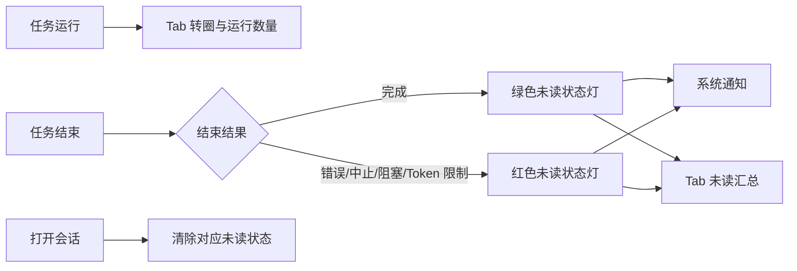

# dsh-notify

DeepSeek Harness 的任务状态通知插件。它在任务运行、完成或异常时，通过系统通知、浏览器 Tab 标题和左侧会话列表提供明确的状态提示。

## 功能

- **系统通知**：完成、错误、中止、阻塞、Token 限制均可通知；可在设置中单独关闭某一类。
- **Tab 状态**：运行中的 DSH Tab 显示转圈和运行会话数；完成或异常会折叠成未读结果计数，支持跑马灯或闪烁。
- **侧栏状态灯**：会话完成且尚未查看时，标题前显示绿色圆点；错误、中止、阻塞或 Token 限制显示红色圆点。打开该会话后清除。
- **不干扰运行状态**：执行中的 session 保留 DSH 自带 loading，等待审批或回答时保留原生警告状态，不与插件状态灯叠加。
- **设置页**：在 WebUI 的 **设置 > 通知** 中配置总开关、系统通知权限、Tab 动画、运行中 spinner、侧栏状态灯和五类结果开关。



## 安装

### 本地安装

在本仓库目录执行：

```sh
dsh plugin --profile web add "file:$PWD"
```

安装后刷新 WebUI。当前运行中的 DSH Web 会自动发现已更新的 profile bundle；若你的部署未启用热更新，重启对应 `dsh web` 进程后刷新页面。

### GitHub Release 安装

创建 `v0.1.0` tag 后，使用已构建的 GitHub release archive 安装：

```sh
dsh plugin --profile web add \
  "https://github.com/weekitmo/dsh-notify/archive/refs/tags/v0.1.0.tar.gz"
```

发布 tag 前，可使用本地安装方式。

## 卸载

```sh
dsh plugin --profile web remove dsh-notify
```

刷新页面；若你的 Web 进程没有自动重载 profile bundle，重启对应 `dsh web` 进程。

## 使用

1. 打开 WebUI 的 **设置 > 通知**。
2. 点击 **请求授权**，在浏览器提示中允许通知。
3. 保持默认配置，或分别调整系统通知、Tab 提示、运行中 spinner、侧栏状态灯及结果类型。

浏览器通知权限被拒后，网页无法再次强制弹出授权框；请从浏览器地址栏的站点权限设置中重新允许通知。

## 配置

浏览器侧设置保存在当前站点的 `localStorage`，默认全部开启：

| 设置 | 默认 |
| --- | --- |
| 系统通知 | 开 |
| Tab 未读结果汇总 | 开 |
| Tab 运行中 spinner | 开 |
| 侧栏绿/红状态灯 | 开 |
| 五类结束结果 | 全开 |
| 未读结果动画 | 跑马灯 |

Host 侧可配置最近回复摘要的最大长度。在 `$DSH_HOME/profiles/web/cordis.patch.yml` 中添加或覆盖：

```yaml
- id: dsh-notify
  name: dsh-notify
  config:
    maxBodyChars: 400
```

## 已知限制

- 系统通知需要浏览器页面保持打开，并受浏览器与操作系统通知权限共同控制。
- 当前 DSH 没有公开的 session-row adornment slot；侧栏状态灯会在结构不匹配或存在同名会话时安全跳过，不会猜测目标会话。
- `document.title` 只能使用文本动画，因此运行中提示使用 Unicode spinner，而不是 CSS 圆环。

## 开发

```sh
pnpm install
pnpm run check
pnpm pack
```

`pnpm run check` 会执行类型检查、测试和构建。发布前需要提交 `lib/` 构建产物，并在 GitHub 仓库设置中添加 `dsh-plugin` topic。

## License

MIT. See [LICENSE](LICENSE).
