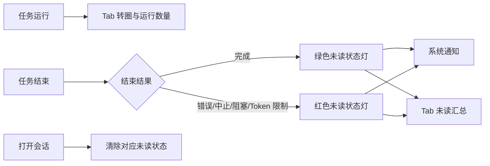

# dsh-notify

[](https://github.com/weekitmo/dsh-notify/actions/workflows/ci.yml) [](https://github.com/weekitmo/dsh-notify/releases/latest) [](LICENSE)

DeepSeek Harness 的任务状态通知插件。它在任务运行、完成或异常时，通过系统通知、浏览器 Tab 标题和左侧会话列表提供明确的状态提示。

## 功能

- **系统通知**：完成、错误、中止、阻塞、Token 限制均可通知；可在设置中单独关闭某一类。
- **Tab 状态**：运行中的 DSH Tab 显示转圈和运行会话数；完成或异常会折叠成未读结果计数，支持跑马灯或闪烁。
- **侧栏状态灯**：会话完成且尚未查看时，标题前显示绿色圆点；错误、中止、阻塞或 Token 限制显示红色圆点。打开该会话后清除。
- **不干扰运行状态**：执行中的 session 保留 DSH 自带 loading，等待审批或回答时保留原生警告状态，不与插件状态灯叠加。
- **设置页**：在 WebUI 的 **设置 > 通知** 中配置总开关、系统通知权限、Tab 动画、运行中 spinner、侧栏状态灯和五类结果开关。



## 安装

前置条件：已安装 `dsh`，且 `pnpm` 在 `PATH` 中。`dsh plugin` 会把安装参数转交给 pnpm。

### 一行安装最新稳定版

使用 curl：

```sh
curl -fsSL https://raw.githubusercontent.com/weekitmo/dsh-notify/main/install.sh | sh
```

或使用 wget：

```sh
wget -qO- https://raw.githubusercontent.com/weekitmo/dsh-notify/main/install.sh | sh
```

`install.sh` 会跟随 GitHub Latest Release 的公开重定向，解析最新稳定 tag，并用固定 tag 安装；不会消耗 GitHub API 配额，也不会跟随 `main` 安装未发布代码。可通过环境变量覆盖 profile 或版本：

```sh
DSH_NOTIFY_PROFILE=web DSH_NOTIFY_VERSION=v0.1.0 sh -c "$(curl -fsSL https://raw.githubusercontent.com/weekitmo/dsh-notify/main/install.sh)"
```

### 固定版本安装（推荐用于可复现部署）

当前版本：`v0.1.0`。

```sh
dsh plugin --profile web add \
  git+https://github.com/weekitmo/dsh-notify.git#v0.1.0
```

也可以安装 Release 中由 CI 产出的预构建包，不需要 git checkout：

```sh
dsh plugin --profile web add \
  https://github.com/weekitmo/dsh-notify/releases/download/v0.1.0/dsh-notify-0.1.0.tgz
```

### 从源码安装

```sh
git clone --branch v0.1.0 --depth 1 https://github.com/weekitmo/dsh-notify.git
cd dsh-notify
corepack enable
pnpm install --frozen-lockfile
pnpm run check
dsh plugin --profile web add "file:$PWD"
```

DSH 不会为 `file:`、Git tag 或 GitHub 源码 archive 额外执行插件的 `build`。本仓库因此提交并发布 `lib/`；从源码开发时仍应运行 `pnpm run check`，确保构建产物与 `src/` 一致。

安装后刷新 WebUI。当前运行中的 DSH Web 会自动发现已更新的 profile bundle；若你的部署未启用热更新，重启对应 `dsh web` 进程后刷新页面。

## 卸载

```sh
dsh plugin --profile web remove dsh-notify
```

刷新页面；若你的 Web 进程没有自动重载 profile bundle，重启对应 `dsh web` 进程。

## 使用

1. 打开 WebUI 的 **设置 > 通知**。
2. 点击 **请求授权**，在浏览器提示中允许通知。
3. 保持默认配置，或分别调整系统通知、Tab 提示、运行中 spinner、侧栏状态灯及结果类型。

浏览器通知权限被拒后，网页无法再次强制弹出授权框；请从浏览器地址栏的站点权限设置中重新允许通知。

## 配置

浏览器侧设置保存在当前站点的 `localStorage`，默认全部开启：

| 设置 | 默认 |
| --- | --- |
| 系统通知 | 开 |
| Tab 未读结果汇总 | 开 |
| Tab 运行中 spinner | 开 |
| 侧栏绿/红状态灯 | 开 |
| 五类结束结果 | 全开 |
| 未读结果动画 | 跑马灯 |

Host 侧可配置最近回复摘要的最大长度。在 `$DSH_HOME/profiles/web/cordis.patch.yml` 中添加或覆盖：

```yaml
- id: dsh-notify
  name: dsh-notify
  config:
    maxBodyChars: 400
```

## 已知限制

- 系统通知需要浏览器页面保持打开，并受浏览器与操作系统通知权限共同控制。
- 当前 DSH 没有公开的 session-row adornment slot；侧栏状态灯会在结构不匹配或存在同名会话时安全跳过，不会猜测目标会话。
- `document.title` 只能使用文本动画，因此运行中提示使用 Unicode spinner，而不是 CSS 圆环。

## 开发

```sh
corepack enable
pnpm install --frozen-lockfile
pnpm run check
pnpm pack
```

`pnpm run check` 会执行类型检查、测试、构建和发布脚本自检。发布前必须提交 `lib/` 构建产物；远程安装直接消费这些文件，DSH 不会自动构建插件。

## 版本与发布

版本和 tag 遵循 [Semantic Versioning 2.0.0](https://semver.org/lang/zh-CN/)：

- `patch`：向后兼容的问题修复。
- `minor`：向后兼容的新功能。
- `major`：不兼容的 API 或行为变更。
- `prepatch` / `preminor` / `premajor` / `prerelease`：预发布版本，默认标识为 `rc`。

先预览下一版本，不修改文件：

```sh
pnpm version:bump patch --dry-run
pnpm version:bump preminor --preid beta --dry-run
```

发布前先提交所有功能代码和最新 `lib/`，保持工作树干净，然后一条命令完成 bump、检查、版本提交、annotated tag 和原子 push：

```sh
pnpm version:bump patch --tag --push
```

预发布示例：

```sh
pnpm version:bump prepatch --preid rc --tag --push
```

也可以传入明确版本，例如 `pnpm version:bump 1.0.0 --tag --push`。脚本会同步更新 README 中的固定 tag 和 `.tgz` 链接，并拒绝脏工作树、非法 SemVer 和重复 tag；tag push 后，`.github/workflows/release.yml` 会再次验证版本、执行 `pnpm run check`、确认 `lib/` 无差异、生成中文 release log，并上传预构建 `.tgz` 与 `install.sh`。

## License

MIT. See [LICENSE](LICENSE).
