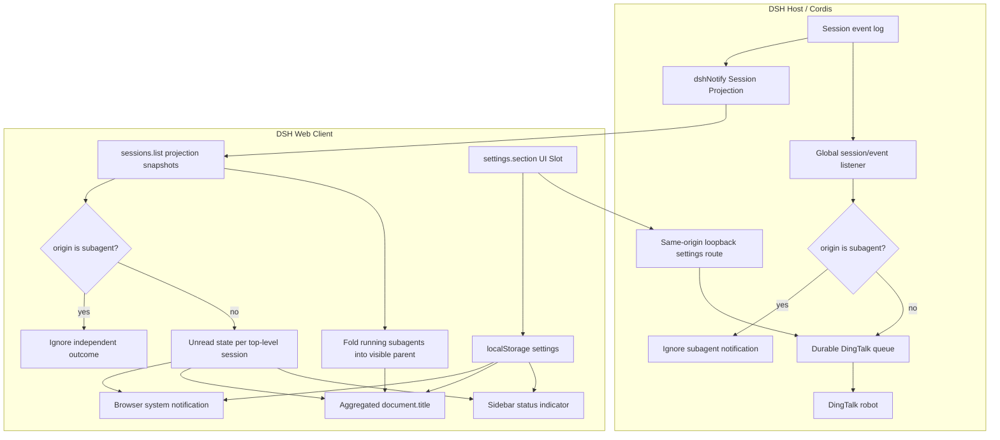

# dsh-notify

English | [简体中文](README.md)

[](https://github.com/weekitmo/dsh-notify/actions/workflows/ci.yml) [](https://github.com/weekitmo/dsh-notify/releases/latest) [](LICENSE)

A task status notification plugin for DeepSeek Harness. It provides clear status updates through system notifications, the browser tab title, and the session list when a task is running, completed, or interrupted by an error.

## Features

- **System notifications**: Receive notifications for each main-agent (top-level session) turn that completes, fails, aborts, blocks, or hits the token limit. Each result type can be disabled separately. Subagents do not notify separately.
- **DingTalk robot**: Configure an Access Token and Signing Secret, independently select success/completion or failure/abort messages, and use do-not-disturb with a missed-message summary.
- **Tab status**: Shows the latest workspace session title while idle, a spinner and session count while running, and an unread result count after completion or failure.
- **Sidebar indicators**: Shows a green dot for an unread completed session and a red dot for an error, abort, block, or token limit. Opening the session clears the indicator.
- **Native state compatibility**: Active sessions keep the built-in DSH loading state, while approval and question prompts keep their native warning state.
- **Configurable behavior**: Control notification permissions, tab animation, favicon, spinner, sidebar indicators, and result types under **Settings > Notifications** in the WebUI.

## Architecture

`dsh-notify` is a standard Cordis Host/Client plugin and does not modify DeepSeek Harness core. It uses DSH Session events, Session Projection, Client Runtime, and UI Slot extension points; it is not an adapter built on the external CLI hooks under `packages/hooks/*`.



The Host entry registers the projection with `ctx.sessionProjections.register(...)`, observes completion events with `ctx.on('session/event', ..., { global: true })`, and manages routes and resources with `ctx.effect(...)`. The Client entry subscribes to `sessions.list` and injects its settings UI through `ctx.slots.inject('settings.section', ...)`.

Subagent Sessions carry `origin: 'subagent'`. Both the Host DingTalk path and the browser system-notification, unread-tab, and sidebar paths filter them at their respective inputs. There is therefore no subagent-success switch today: the effective behavior is permanently off. Running subagents are only folded into their visible parent's running count.

A notification describes a main-agent turn reaching `turn/end`, not completion of an entire project objective. If a main-agent turn ends while background subagents are still running, a main-agent turn-completed notification can still appear; it was not triggered by a subagent finishing.

## Installation

Prerequisite: `pnpm` is available in `PATH`. If `dsh` is missing, the installer prompts to install it with `bun` when available, then falls back to `npm`; installation runs only after entering a lowercase `y`.

### Install the Latest Stable Release

On macOS, Linux, or another POSIX shell, use curl:

```sh
curl -fsSL https://github.com/weekitmo/dsh-notify/releases/latest/download/install.sh | sh
```

Or use wget:

```sh
wget -qO- https://github.com/weekitmo/dsh-notify/releases/latest/download/install.sh | sh
```

From Windows CMD, clone the repository and run the batch installer. Confirm execution if Windows asks for permission:

```bat
git clone --depth 1 https://github.com/weekitmo/dsh-notify.git
cd dsh-notify
install.bat
```

Refresh the WebUI after installation. If the plugin does not load automatically, restart the corresponding `dsh web` process and refresh the page again.

For pinned versions, checksum verification, and source installation, see the [installation guide](docs/installation.md).

## Enable and Use

1. Open **Settings > Notifications** in the WebUI.
2. Enable the notification features you need.
3. For system notifications, click **Request permission** and allow notifications in the browser prompt.
4. For DingTalk notifications, open the official setup guide from the DingTalk group, create a custom robot, enter its Access Token and Signing Secret, select the outcomes to send, and save.
5. Keep the defaults or adjust tab indicators, the running spinner, sidebar indicators, and result types.

DingTalk outcome filters are independent from browser notification switches. Disabling system notifications or a local outcome does not disable an enabled DingTalk category. After browser notification permission has been denied, the page cannot force the permission prompt to appear again. Re-enable notifications in the site's permission settings from the browser address bar.

## Configuration

Browser settings are stored in `localStorage` for the current site. The defaults are:

| Setting | Default |
| --- | --- |
| System notifications | On |
| Maximum system notification body characters | 400 (range 100–2000) |
| Independent subagent completion notifications | Off (fixed; only folded into parent running counts) |
| Unread result summary in the tab | On |
| Running spinner in the tab | On |
| Idle tab title animation | On |
| Hidden-page idle favicon indicator | Off |
| Green/red sidebar indicators | On |
| All five result types | On |
| Unread result animation | Marquee |
| DingTalk success/completed messages | On (after credentials are configured) |
| DingTalk failed/aborted messages | On (includes errors, blocks, and token limits) |
| DingTalk do not disturb | Off (default window 23:00-08:00) |
| Missed-message summary after do not disturb | Off |

DingTalk credentials and policy are stored in `$DSH_HOME/dsh-notify/settings.json`, never in browser `localStorage`, and the API never returns credentials to the page. Credential management accepts only same-origin WebUI requests over a local loopback address; DingTalk settings cannot be changed through a LAN or public WebUI address. Do not disturb uses `Asia/Shanghai`, supports overnight ranges, and persists held messages in `dingtalk-missed.json` before sending one digest at the end. Ordinary task results also enter this durable queue before delivery and retry after failure or restart. Delivery is at least once: an extreme crash window may duplicate a message, but does not silently lose it. Rotating robot credentials clears the old queue before saving the new credentials, and disabling an outcome category removes matching pending messages. POSIX systems use a `0700` directory and `0600` files; Windows relies on the current user's file ACL while still rejecting symlinks and non-regular files.

The maximum system notification body length can be changed directly in the dsh-notify settings page and takes effect immediately.

## Uninstall

```sh
dsh plugin --profile web remove dsh-notify
```

Refresh the page. If the plugin is still present, restart the corresponding `dsh web` process.

## Additional Documentation

- [Installation guide](docs/installation.md): Pinned versions, SHA256 checksums, and source installation.
- [Development guide](docs/development.md): Known limitations, local development, and validation commands.
- [Versioning and releases](docs/releasing.md): Versioning rules and the maintainer release process.

## License

MIT. See [LICENSE](LICENSE).
